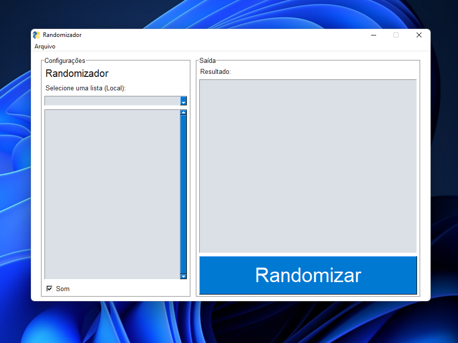

# Randomizador
### Interface gráfica para o Python Choice

O randomizador é uma ferramenta para conseguir sortear em listas a partir de arquivos de texto, com itens separados por linhas, também sendo capaz de obter listas online do formato RAW.

A interface utiliza o PySimpleGUI para sua construção com base no TKinter do próprio python!

Para download do executável, clique em download! (Download apenas para windows no momento.)

### Para gerar o EXE via PyInstaller:
_pyinstaller --onefile --windowed --name "Randomizador" --add-data "bip.mp3;."  "main.py"_
_* Lembre-se de deletar o exportado anteriormente da pasta dist_

# [Download](https://github.com/Lokost/Randomizador/releases)
